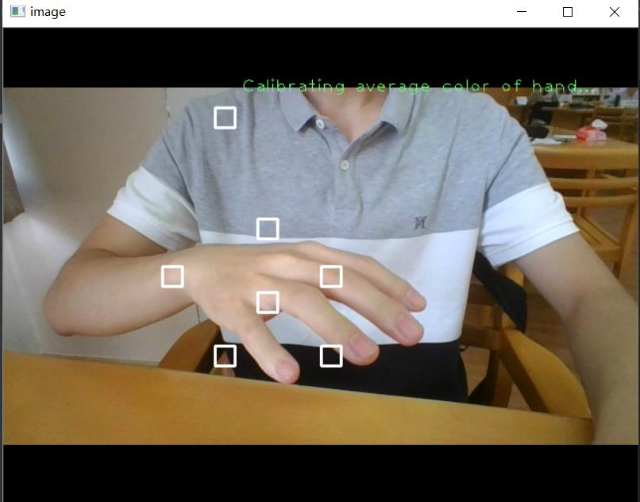
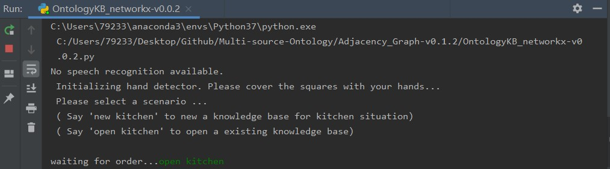
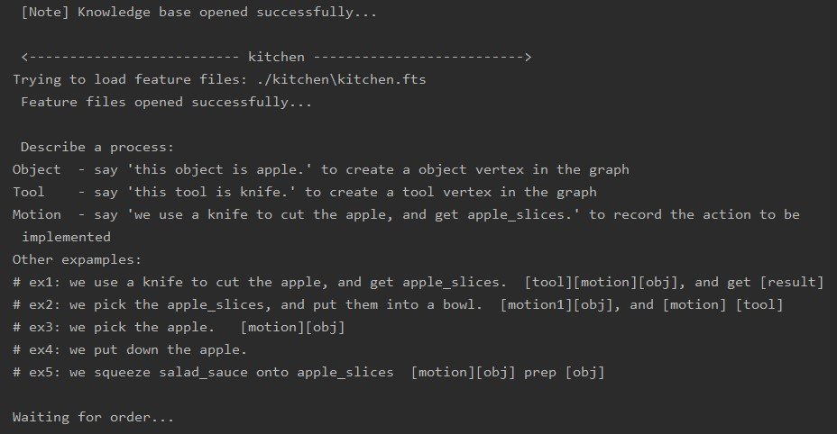
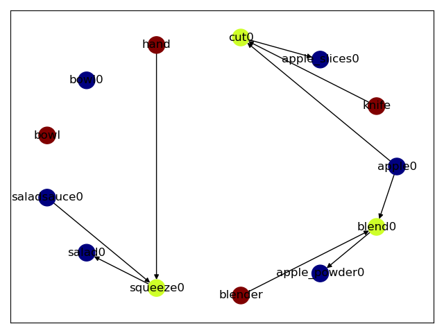

# Multi-source Ontology
 Co-developed version for ontology knowledge graph.
 We designed a knowledge graph for kitchen senarios based on a complex data structure.

 # Installation
 Just clone this repsitory and ensure that you have downloaded following packages:
 1. opencv >v3.4.2
 2. networkx v2.5
 3. matplotlib
 4. deepspeech(optional)

# Brief tutorial

## Run the main python file
```python
python ./OntologyKB_networkx-v0.0.2.py [The path where you would like your knowledge graphs to be stored]
Ex: python ./OntologyKB_networkx-v0.0.2.py ./
```

## Calibrate your hand color
Before we get started, the program needs to adjust its hand detection module to the environment.
As shown in the image below, you place your hands in front of your webcam for a few seconds.


## Select your knowledge graph
Open an existing knowledge graph or create a new one.


## Train your knowledge graph
If you would like the program to learn an object, you could say/type "this object is apple.". Then you need tell the knowledge graph about the state, category, contents of this object (default: none), and finally the program will track the positon of your hands and take a photo of that object.

If you would like the program to learn a tool, you could say/type "this tool is knife.", then the program will track the positon of your hands and take a photo of that tool.

If you would like the program to record an action, you could say/type "we use a knife to cut the apple, and get apple_slices.", then the program will use the camera to record your action as you implement this action until you say/type "finish".


## Check your knowledge graph
Your knowledge graph will show up in form of a popup window whenever an action is recorded successfully. You can also say/type "display" to check it at any time.

